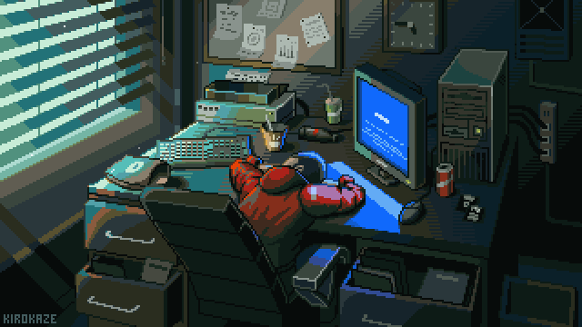
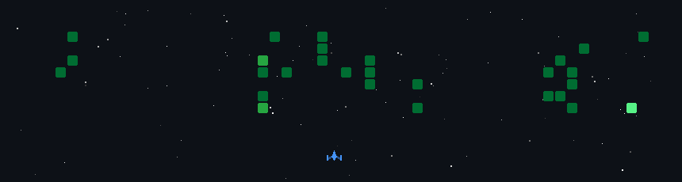

  <!-- Header Banner / Title -->
  
  <h1>Hi there, I'm <a href="https://github.com/LrRyPa">Larry Polin Anugrah</a> 👋</h1>
  
 <strong>Information Systems Student at Mulawarman University</strong>

  

     Aspiring <b>Data Scientist</b> & <b>Machine Learning Engineer</b> 
  

  

    
  

---

###  About Me 👨‍💻

-   **Education:** Information Systems Undergraduate at **Universitas Mulawarman**
-   **Focus Area:** Data Science, Machine Learning, & Predictive Analytics
-   **Current Activities:** Building end-to-end data pipelines, ML models, and interactive analytics apps
-   **Reach Me:** Feel free to connect for collaborations or data discussions!

---

### 🛠️ Tech Stack & Tools

**Languages & Data Manipulation**

  
  
  
  

**Machine Learning & Data Science Tools**

  
  
  
  

---

  

---

  <i> Thanks for stopping by! </i>

